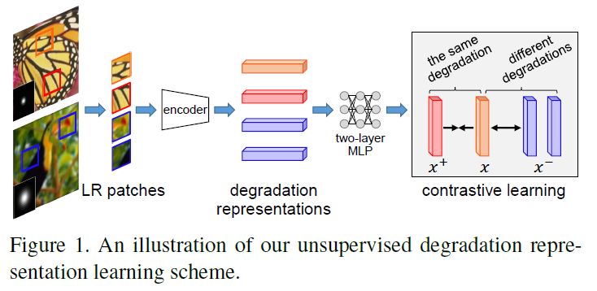
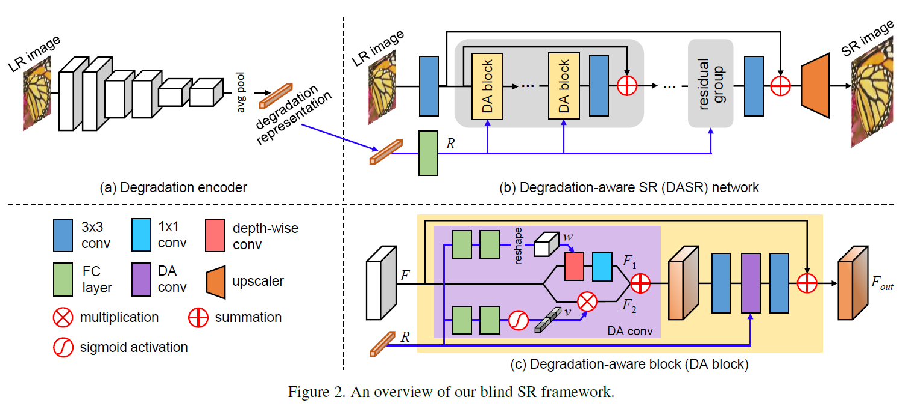
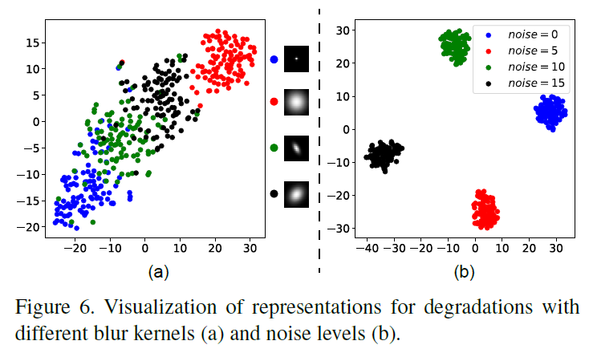
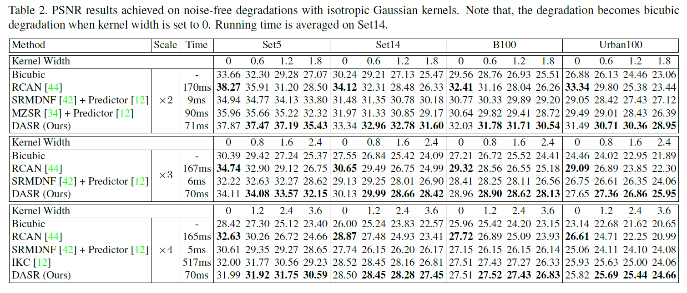
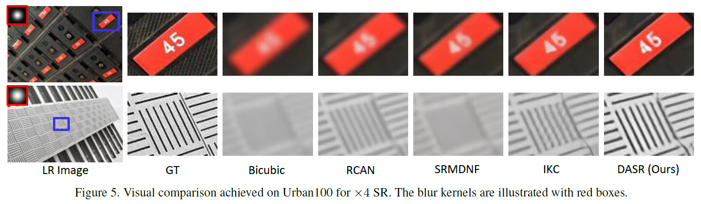
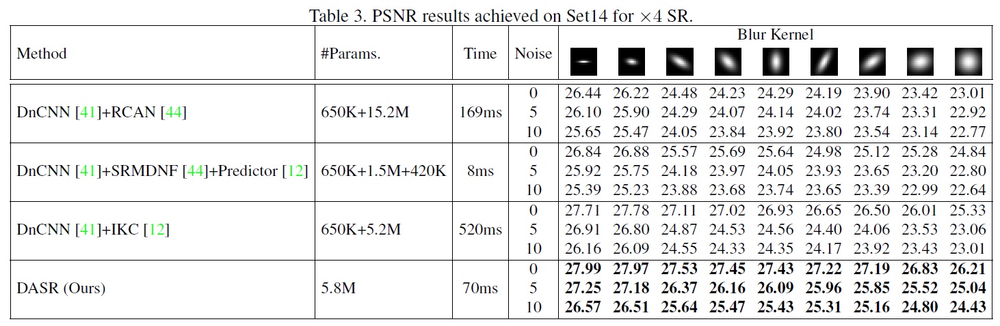
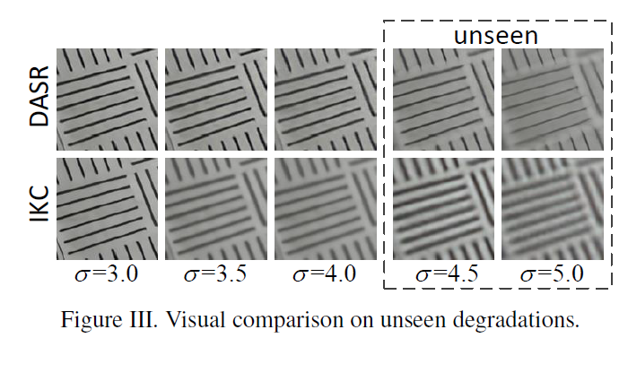

# DASR
Pytorch implementation of "Unsupervised Degradation Representation Learning for Blind Super-Resolution", CVPR 2021

[[arXiv]]()


## Overview

<p align="center">  </p>


<p align="center">  </p>


## Requirements
- Python 3.6
- PyTorch == 1.1.0
- numpy
- skimage
- imageio
- matplotlib
- cv2


## Train
### 1. Prepare training data 

1.1 Download the [DIV2K](https://data.vision.ee.ethz.ch/cvl/DIV2K/)  dataset and the [Flickr2K](http://cv.snu.ac.kr/research/EDSR/Flickr2K.tar) dataset.

1.2 Combine the HR images from these two datasets in `your_data_path/DF2K/HR` to build the DF2K dataset. 

### 2. Begin to train
Run `./main.sh` to train on the DF2K dataset. Please update `dir_data` in the bash file as your data path.


## Test
### 1. Prepare test data 
Download [benchmark datasets](https://github.com/xinntao/BasicSR/blob/a19aac61b277f64be050cef7fe578a121d944a0e/docs/Datasets.md) (e.g., Set5, Set14 and other test sets) and prepare HR/LR images in `testsets/benchmark` following the example of `testsets/benchmark/Set5`.


### 2. Begin to test
Run `./test.sh` to test on benchmark datasets. Please update `dir_data` in the bash file as your data path.


## Visualization of Degradation Representations
<p align="center">  </p>

## Comparative Results
### Noise-Free Degradations with Isotropic Gaussian Kernels

<p align="center">  </p>

<p align="center">  </p>


### General Degradations with Anisotropic Gaussian Kernels and Noises
<p align="center">  </p>

<p align="center">  </p>

### Unseen Degradations 

<p align="center">  </p>

### Real Degradations (AIM real-world SR challenge)

<p align="center">  </p>

## Citation
```
@InProceedings{Wang2021Unsupervised,
  author    = {Wang, Longguang and Wang, Yingqian and Dong, Xiaoyu and Xu, Qingyu and Yang, Jungang and An, Wei and Guo, Yulan},
  title     = {Unsupervised Degradation Representation Learning for Blind Super-Resolution},
  booktitle = {CVPR},
  year      = {2021},
}
```

## Acknowledgements
This code is built on [EDSR (PyTorch)](https://github.com/thstkdgus35/EDSR-PyTorch), [IKC](https://github.com/yuanjunchai/IKC) and [MoCo](https://github.com/facebookresearch/moco). We thank the authors for sharing the codes.

